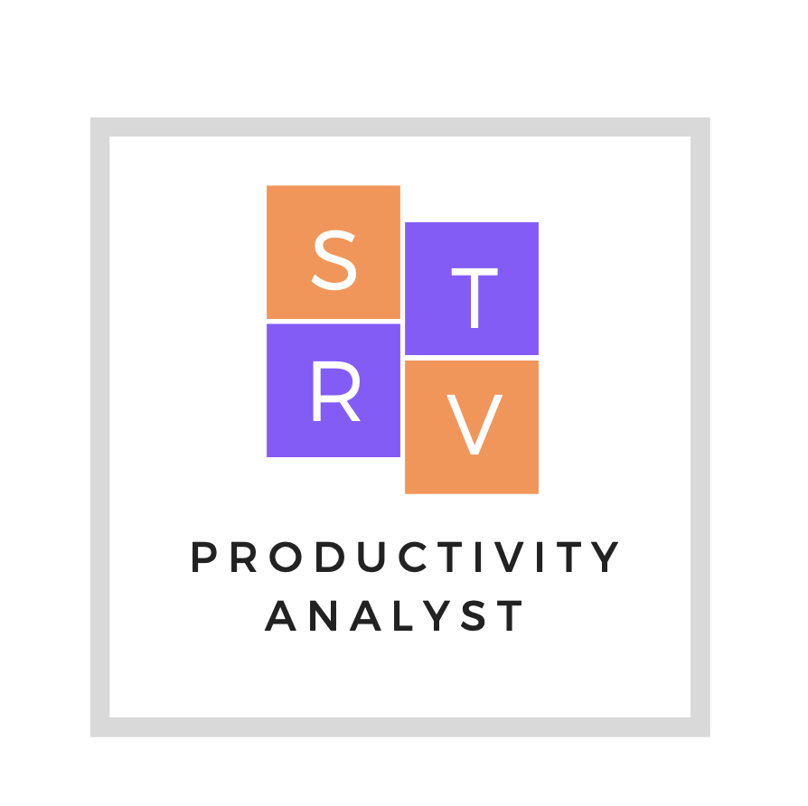
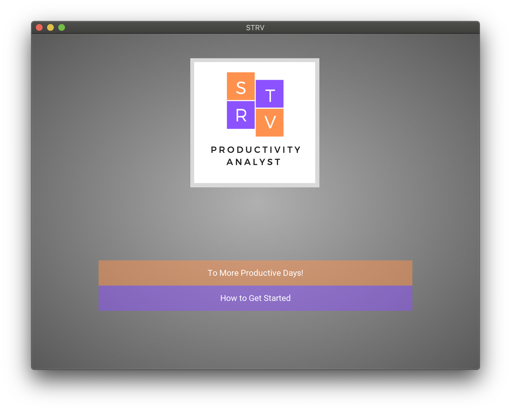
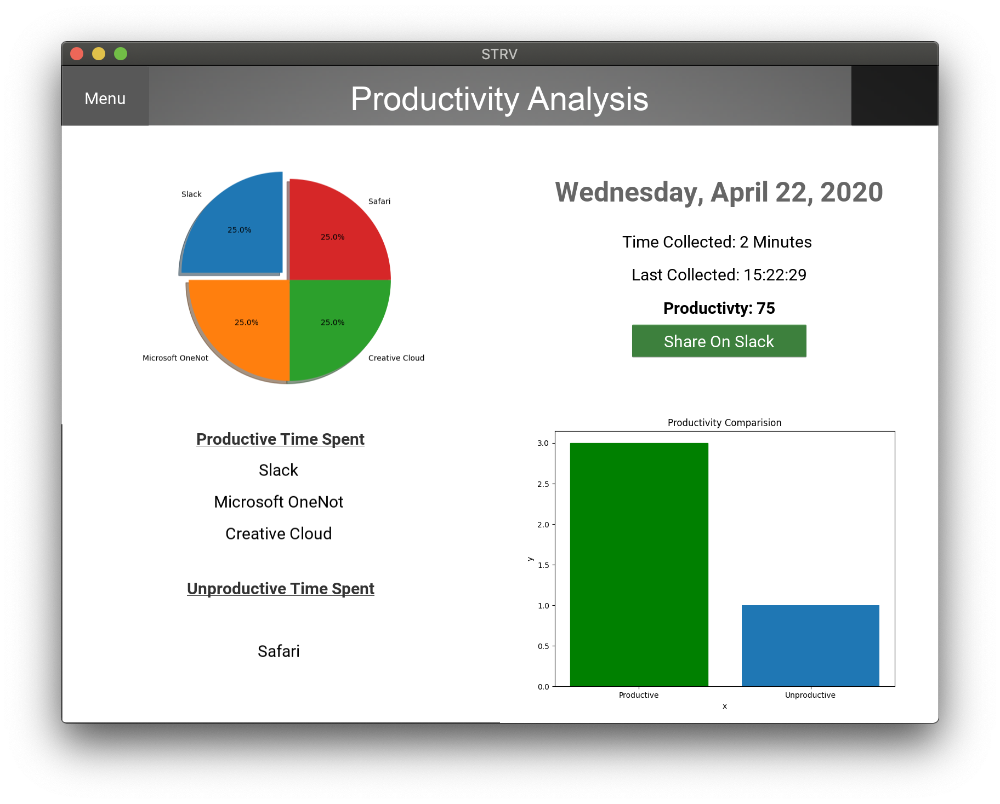

# Productivity_Analytics
## Mini-Project 2 for CPSC 4720 

    For Mini-Project 2, we were tasked with creating a Desktop application for measuring the users productivity. Here we will focus on the process of software production within industry; moving from wire-frames to implementation. While learning about good design practices to make a visually appealing interface.
___

## How to Get Started Using STRV
1. First you need to install the necessary python libraires. This can be done using python’s pip terminal command. Denote you must be using python 3.
• python -m pip install kivy
• python -m pip install ffpyplayer • pip install -U matplotlib
2. Then you need to tell STRV the applications you wish to track. This can be done by creating two text files listing all of the applications you wish to track (pressing enter between each application).
• Place all of the applications you wish to track in a file names aal.txt. This stands for acceptable application list. • Place all of the application from aal.txt that you deem as productive into a file name prod app.txt.
3. Once complete, places the txt files in the root project directory ( i.e. in the same folders main.py ).
4. Open your terminal to the root project directory and execute python3 main.py
5. Then the application will open and you will be faced with the landing page. You may either continue to the main dashboard or read the in-app set-up guide that will direct the user to complete steps 2-4 again.
6. When you are finally ready to start tracking, enter the main dash board and press the green start button in the upper right hand corner of the screen.
7. Finally, continue about your day leaving STRV running in the background. Your data will automatically populate on the main dashboard as it happens. Now go reach your Stride with STRV!

___

For a full report please read [Mini Project 2 Report](Mini_Project_2_Report.pdf )

___
## Resources 
“17.1. Subprocess - Subprocess Management.” 17.1. Subprocess - Subprocess Management - Python 2.7.18 Documentation, docs.python.org/2/library/subprocess.html.

“Clock Object.” Clock Object - Kivy 1.11.1 Documentation, kivy.org/doc/stable/api-kivy.clock.html.

Dossetto, Fio. “Understanding Heatmaps for Better UI Design: Inside Design Blog.” Invisionapp, Inc., www.invisionapp.
com/inside-design/heatmaps-for-ui-design/ .

“Kivy Framework.” Kivy Framework - Kivy 1.11.1 Documentation, kivy.org/doc/stable/api-kivy.html.

“Labeling a Pie and a Donut.” Labeling a Pie and a Donut - Matplotlib 3.2.1 Documentation, matplotlib.org/gallery/pie_and_polar_charts/pie_and_donut_labels.html#sphx-glr-gallery-pie-and-polar-charts-pie-and-donut-labels-py.

Norman, Donald A. The Design of Everyday Things. Basic Books, 2013. 

Slack. “Slack API.” Slack, api.slack.com/.

“Visualization with Python¶.” Matplotlib, matplotlib.org/.